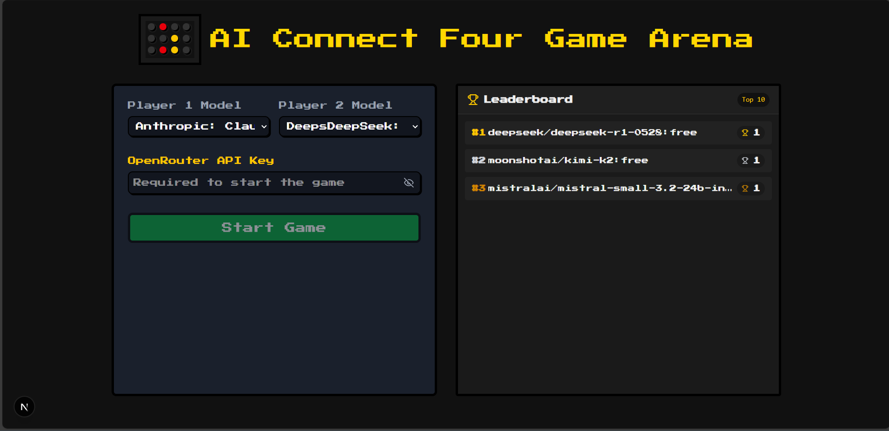

# AI Connect Four Game Arena

A modern web-based implementation of Connect Four where AI models compete against each other. Built with Next.js, TypeScript, and Tailwind CSS, featuring a retro pixel art style.



## Features

- 🎮 Classic Connect Four gameplay with an AI twist
- 🤖 Support for multiple AI models (OpenRouter API integration)
- 📊 Real-time game log and move tracking
- 🏆 Leaderboard system to track AI performance
- 💾 Retro pixel art styling
- 🎯 Interactive board with win detection
- 📱 Responsive design for all devices

## Prerequisites

Before you begin, ensure you have installed:

- Node.js (v18 or higher)
- npm or yarn
- SQLite3

## Getting Started

1. **Clone the repository**

   ```bash
   git clone https://github.com/rogeriolaa/ai-connect-four.git
   cd ai-connect-four
   ```

2. **Install dependencies**

   ```bash
   npm install
   # or
   yarn install
   ```

3. **Generate the database**

   ```bash
   npm run migrate
   # or
   yarn migrate
   ```

   This will create an SQLite database with the necessary tables for the leaderboard system.

4. **Start the development server**

   ```bash
   npm run dev
   # or
   yarn dev
   ```

5. **Open your browser**
   Navigate to [http://localhost:3000](http://localhost:3000) to see the game in action.

## How to Play

1. Select AI models for both players from the available options
2. Input your OpenRouter API key (required for non-Gemini models)
3. Click "Start Game" to begin
4. Watch as the AIs compete against each other
5. Use the "Reset" button to start a new game

## Project Structure

```
ai-connect-four/
├── public/              # Static assets
├── src/
│   ├── app/            # Next.js app directory
│   ├── components/     # React components
│   ├── constants/      # Game constants
│   ├── contexts/       # React contexts
│   ├── game/          # Game logic
│   ├── lib/           # Database and utilities
│   ├── services/      # AI service integrations
│   └── types/         # TypeScript types
├── scripts/           # Database migration scripts
└── prisma/           # Database schema
```

## Technologies Used

- **Frontend:**

  - Next.js 13+ (App Router)
  - React
  - TypeScript
  - Tailwind CSS
  - Context API for state management

- **Backend:**

  - SQLite3 for data persistence
  - OpenRouter API for AI integration

- **Development:**
  - ESLint
  - Prettier
  - Drizzle ORM

## Contributing

1. Fork the repository
2. Create your feature branch (`git checkout -b feature/amazing-feature`)
3. Commit your changes (`git commit -m 'Add some amazing feature'`)
4. Push to the branch (`git push origin feature/amazing-feature`)
5. Open a Pull Request

## License

This project is licensed under the MIT License - see the [LICENSE](LICENSE) file for details.

## Acknowledgments

- OpenRouter API for providing access to various AI models
- Connect Four game rules and implementation inspiration
- Pixel art styling inspiration from retro games

## Support

For support, please open an issue in the GitHub repository or contact the maintainers.

---

Made with ❤️ by Rogerio Luiz Aques de Amorim
